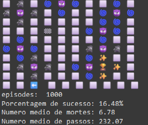
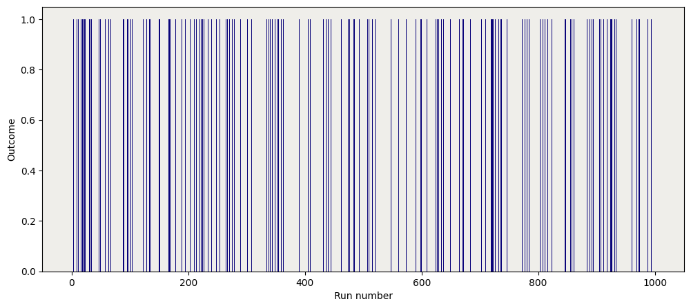
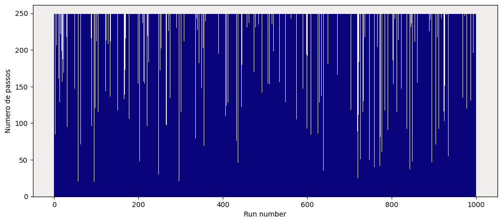
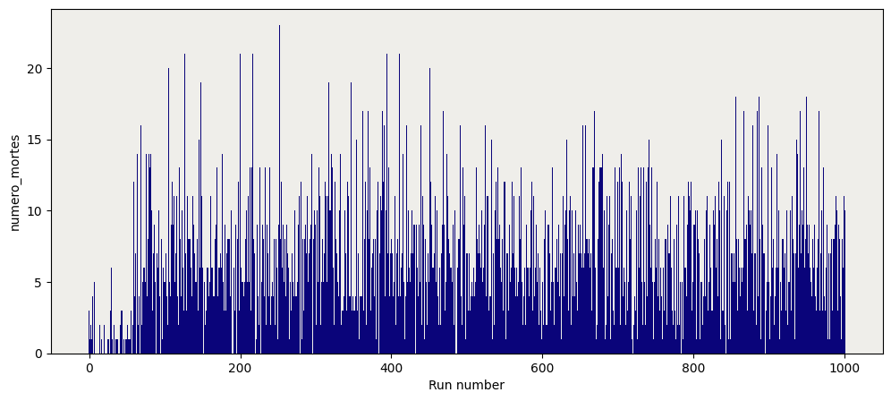

# Wumpus World DQL Agent
## Project Overview
This project represents the final assignment for the Intelligent Systems course, implementing a Deep Q-Learning (DQL) agent to navigate the classic Wumpus World environment. The agent learns to find gold while avoiding dangers like pits and the Wumpus through reinforcement learning.

## Environment Description
The Wumpus World is represented as a 10x10 grid where:
- 🏁 Starting position is fixed at (3,3)
- 🏆 Gold is the target reward
- 😈 Wumpus and pits are deadly obstacles
- 🌀 Breezes indicate nearby pits
- 🦨 Stenches indicate nearby Wumpus
- ✨ Flashes indicate nearby gold



## Features
- Deep Q-Network (DQN) implementation with 6 neural network layers
- Experience replay memory for improved learning
- Epsilon-greedy exploration strategy
- Automatic environment sensing and reward calculation
- Performance visualization with matplotlib
- GPU support when available

## Technical Details
- Built using PyTorch for deep learning
- Uses numpy for matrix operations
- Implements replay memory for experience replay
- Features customizable hyperparameters
- Includes comprehensive state and action space definitions

## Requirements
```
torch
numpy
matplotlib
tensorflow
```

## Usage
Run the main script to start training:
```python
python wumpus_dql.py
```
The program will display:
- Real-time training progress
- Success rate statistics
- Average steps per episode
- Death count
- Visualization plots

# Training Visualization
The code generates three plots showing the agent's learning progress:


*Graph showing the success rate of outcomes per episode*


*Graph showing the number of steps per runtime*


*Graph showing the number of deaths per runtime*

[Rest of the README remains unchanged...]

## Credits and References
This implementation draws from several key sources:

1. **PyTorch DQL Tutorial**  
   [https://pytorch.org/tutorials/intermediate/reinforcement_q_learning.html](https://pytorch.org/tutorials/intermediate/reinforcement_q_learning.html)  
   This tutorial provided the foundation for implementing the DQN architecture and training loop.

2. **Q-Learning for Beginners**  
   [https://towardsdatascience.com/q-learning-for-beginners-2837b777741](https://towardsdatascience.com/q-learning-for-beginners-2837b777741)  
   An excellent resource that helped establish the fundamental concepts of Q-learning and its application.

3. **Deep Reinforcement Learning Hands-On** by Maxim Lapan  
   Packt Publishing Ltd, 2020  
   This comprehensive book provided detailed insights into reinforcement learning implementation and best practices.

## Project Structure
```
- Environment Definition
- DQL Implementation
- Neural Network Architecture
- Training Loop
- Visualization Functions
- Utility Functions
```

